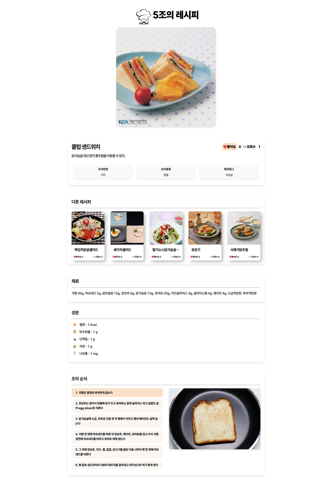

# 5조의 레시피 RecipeOfFive 
레시피 검색 페이지를 구현하고, AWS를 통해 배포한 서비스 입니다.

## Introduction

배포 주소: https://pda.recipeoffive.site

## Tech Stacks

### Front-End

### Back-End

### Distribution

### Communication

### Environment

## Screens

|                             메인(랭킹) 페이지                           |                          메인(결과) 페이지                           |                          결과(상세) 페이지                           |
| :-----------------------------------------------------------------: | :--------------------------------------------------------------: | :--------------------------------------------------------------: |
|  |  |  |

## Others

### Period

2024.05.23 - 31 (7 days)
- 기회 및 디자인 : 2 days
- 개발 및 구현 : 3.5 days
- 테스트 및 수정 : 1 days
- 회고 및 정리 : 0.5 days

### Members

|                                      김윤경                                        |                                      나인규                                        |                                      장호익                                         |                                       하윤철                                       |
| :------------------------------------------------------------------------------: | :-------------------------------------------------------------------------------: | :-------------------------------------------------------------------------------: | :-------------------------------------------------------------------------------: |
|  |  |   |  |
|                  [@do-yoongyo2](https://github.com/do-yoongyo2)                  |                     [@InGyu Na](https://github.com/sktmdgus1212)              |            [@HoIk Jang](https://github.com/JangHoIk1)                             |           [@Yoon](https://github.com/yoon-97)                                  |

